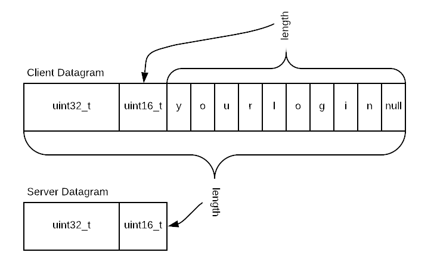

# UDP Blaster

In this project you will write both a client and a server that will
exchange packets. The client formats payloads and sends them to the
server. The server extracts certain information from the payload and
sends a response back to the client. If all goes well, there is a
specific reply from the server for each payload sent by the client.

UDP is a best effort protocol. As both your client and server should be
designed to send and receive datagrams as quickly as possible, there is
a strong possibility datagrams will be lost, even if both client and
server are running on your own machine, let alone running over the
Internet.

## Learning Objectives

This project is designed to:

1. Introduce "systems-style" programming. For some of you, this may be
the first time you are asked to write code using C APIs that are heavily
pointer driven.

2. Introduce network programming using UDP as the transport protocol.

3. Introduce network byte ordering.

4. Introduce makefiles.

5. Lead to discussion about programming practices relating to high speed
input / output.

## Project Specifications Are Critical

You are writing both client and server. Your server must communicate
correctly with my client. Your client must communicate correctly with
my server. Therefore, like never before, you must pay strict attention
to this specification. If you deviate in anyway, you might be able to
talk between your own client and server but you will fail to talk to
mine. And therefore, fail in your project.

It prove difficult for me to provide an operating server and client to
you as I would have to support 4 architectures times 2 programs (as I am
not going to distribute the source code for obvious reasons). I would
have to provide binaries for both client and server for:

* Intel WSL

* ARM WSL

* Intel Mac

* ARM Mac

This will be a challenge.

## Byte Ordering

Big endian and small endian computers coexist on the same network.
Therefore, a standard byte ordering must be defined. This is called the
network byte ordering. For each architecture, an `include` file will
define:

* ntoh functions which convert network to host byte ordering

* hton functions which convert host to network byte ordering

Note that text is not impacted by byte ordering differences due to
network communication. Byte ordering is an issue for 16, 32 and 64 bit
values.

## getopt

You *must* implement all command line options exactly as specified.

Command line options are parsed using `getopt`. A `getopt` tutorial has
been provided to you.

## Which Errors Should Cause an Abort

Exit the program (client or server) if there is an error during:

* `socket()`

* `fcntl()`

* any memory allocation

* `gethostbyname()`

* `bind()`

Remember to clean up after yourself if you are aborting. For example,
close what successfully opened, free what was successfully allocated.

You're in the big leagues now. If any error that causes an abort should
happen, `main()` must not return 0! Points off if this doesn't happen.

## Which Errors Should NOT Cause an Abort

Once any dynamically allocated memory is allocated and all network
setup is complete, any other errors should be noted but do not cause
an abort.

For example, in the server if `sendto()` reports the wrong number of
bytes sent, emit a descriptive error message and keep going. Error
messages should be clear, for example:

```text
ERROR unknown sequence number received: 91
```

## Non-blocking IO

Your client program will be sending as fast as possible. The server will
be responding as quickly as it can. The network stack on both sides have
a fairly limited number of packets they can buffer before dropping them.

Additionally, the client must attempt to read responses from the server
**but not block on the read if no data is available**.

Therefore, your client must **interleave** transmission and reception.
E.g. inside the main loop you do one send and one attempt to receive
(remember that reading does not block). But even this may not be
performant. Maybe your main loop does one send and several attempts to
receive?

**This bears repeating:** The client cannot send out 262,000 packets and
*then* start reading. In the inner loop you must **both** transmit and
attempt to read.

**The client's socket must be set to non-blocking IO.** This is
likely the first time you've ever seen this.

The server can block on reading because it has nothing to do if there is
no packet. If there **is** a packet, it replies immediately. Again, the
blocking / non-blocking discussion is for the client.

Reading from something normally blocks until there is something to read.
This is not acceptable for the client. The UDP socket you create will
need to be set to non-blocking. Do this with the ```fcntl``` system call
on an already opened DGRAM (UDP) socket.

Here's the Beej comments on [fcntl](https://beej.us/guide/bgnet/html/index-wide.html#fcntlman).

Once the socket is set to non-blocking, attempting to read when there
isn't anything there will return immediately. It is up to you to tell
the difference between an error and there simply no data being
available. Check `errno` for two values - `EAGAIN` and `EWOULDBLOCK`. If
`errno` is either of these there wasn't really an error - just nothing
to read.

## Includes You Will Need

Here's what I included in my client:

```c++
#include <iostream>
#include <iomanip>
#include <string>
#include <set>
#include <cstdlib>

#include <stdio.h>
#include <sys/socket.h>
#include <netinet/in.h>
#include <netdb.h>
#include <string.h>
#include <arpa/inet.h>
#include <memory.h>
#include <getopt.h>
#include <unistd.h>
#include <fcntl.h>

#include "defaults.hpp"
#include "structure.hpp"
```

Here's what I included in my server:

```c++
#include <iostream>
#include <string>

#include <stdio.h>
#include <stdlib.h>

#ifdef	 __linux__
#include <unistd.h>
#endif

#include <getopt.h>
#include <memory.h>
#include <netdb.h>
#include <netinet/in.h>
#include <sys/socket.h>
#include <arpa/inet.h>
#include <assert.h>

#include "defaults.hpp"
#include "structure.hpp"
```

Maybe I included too much, maybe not.

## File Names and Structure

Your entire client must be coded in a single file called `client.cpp`.

Your entire server must be coded in a single file called `server.cpp`.

The `makefile` you are given assumes this. See next.

## `makefile`

You are given this `makefile`:

```text
CFLAGS	= -Wall --pedantic -std=c++11 -g
CC		= g++
COBJS	= client.o
SOBJS	= server.o
srcs	= $(wildcard *.cpp)
deps	= $(srcs:.cpp=.d)

all		: client server

client	: 	$(COBJS)
		$(CC) -o $@ $(COBJS)

%.o: %.cpp
		$(CC) -MMD -MP $(CFLAGS) -c $< -o $@

server	:	server.o
		$(CC) -o $@ server.o

.PHONY: clean

clean:
		$(RM) $(COBJS) $(SOBJS) $(deps) a.out core

-include $(deps)
```

When you *zip* together your project, it must be "ready to go"
on my end. That is, you must supply all files needed for me to
simply enter `make all` and `make clean` when grading your
work. Five points will be deducted from your score if I have
to figure out what is missing from your *zip* file.

## defaults.hpp

You are given `defaults.hpp`. It contains:

```c++
#pragma once
/* You may not alter this in anyway. */

#define	PORT_NUMBER				39390
#define SERVER_IP				"127.0.0.1"
#define NUMBER_OF_DATAGRAMS		(1 << 16)
```

It provides the default values for: port number, destination address and
the number of packets to send. You may not alter these default values.
You can, of course, override the port number and destination address on
the command line. If you implement `-d` one of the things it might do is
send only 1 packet for debugging purposes. Implementing the `-d` option
is at your discretion - it will not be used using grading.

Remember to include `defaults.hpp` in the *zip* file you submit.

## Datagram Contents

You are given this in `structure.hpp`:

```c++
#pragma once

#include <stdint.h>

struct ClientDatagram
{
	uint32_t sequence_number;
	uint16_t  payload_length;
    // The payload comes next.
};

struct ServerDatagram
{
	uint32_t  sequence_number;
	uint16_t  datagram_length;
};
```

Remember to include `structure.hpp` in the *zip* file you submit.

Notice the comment in the `ClientDatagram` definition. It says that
*after this struct comes the payload* (which is your Carthage user
name).

If your user name were `yourlogin`, then a `ClientDatagram` will look
like the top structure.



Pay close attention to the lengths as they are defined as different
values depending upon whether you are the client or the server. If you
are the client, then `payload_length` is the length of your null
terminated login name. If you are a server, the `datagram_length` is
defined as the size of the entire packet sent by the client to the
server.

Recall byte ordering issues which concern `uint32_t` and `uint16_t` but
not the login name.

Your client will count the number of datagrams sent. As this value
increases, it is placed in `sequence_number` in the `ClientDatagram`.
The server pulls this value out of each datagram it receives, puts
the value into its reply datagram along with a computed length.

When client and server `sequency_numbers` match, that's a success.

## Client

The client prepares a number of datagrams with a specific format. It
sends these and also looks for specially formatted responses from a
server located at the "destination address" specified by the `-s` option
(or a default value).

You *must* implement the `-h`, `-s` and `-p` options.

* `-h` prints help information and exits.

* `-s` allows you to override the default of 127.0.0.1.

* `-p` allows you to override the default destination port of 39390.

You *may* implement the `-d` option. This option is for you to enable
debugging features that you might design and implement.

**There are two more command line options you must support but these
will be described later, once you've had a chance to experience some
misery.**

Just kidding, feel free to read on to be forewarned about the misery.

As described [above](#non-blocking-io), the client's socket must be
set to non-blocking. Your inner loop must interleave sending and
attempting to read.

The client's job includes matching the sequence numbers it sends to
sequence numbers it receives back from the server.

Hint: Use the C++ `set` to do the bookkeeping. Add a sequence number
to the set when sending its corresponding packet. Upon receiving a
packet from the server, extract its sequence number. Check to ensure
the sequence number was already in the set. If it isn't either you have
a bug adding numbers to the set or you received the sequence number
before (and removed it). In these cases, print an error. Assuming the
sequence number contained in a server datagram is present in the set,
remove it.

After sending all the datagrams and reading back any replies from the
server, any sequence numbers remaining in the set indicates lost
datagrams. Report these.

## Additional Guidance on the ClientDatagram

You saw the `ClientDatagram` structure above. That structure has *two*
members.

A properly formatted ClientDatagram has *three* members, the last
being the payload. Dynamically allocate enough space for the defined
structure plus the complete payload. Recall this line from above:

```c++
size_t client_datagram_length = sizeof(ClientDatagram) + payload_length;
```

Pointer arithmetic is used to locate the first byte of the payload.

## Server Program

The server program must be run before your client program. A properly
written server can service multiple clients at the same time since
datagrams do not have any sense of a persistent connection. Everything
the server needs to know to acknowledge a packet is contained in the
received packet (and associated metadata).

Upon receiving a packet from a client, the server attempts to interpret
the bytes as a ClientDatagram. It creates an acknowledgement by
sending back the same sequence number contained in the received packet.
It also sends back the total number of bytes in the received datagram.
In other words, the number of bytes returned by `recvfrom()`.

***Unlike the client**, the server can block on reads. Servers respond
to client requests so they may block on read waiting for these.

### Server Command line options

You must support the following command line options:

* `-h` Displays help information and exits. See additional information
in the description of the Client program.

* `-p port_number` The default port number is 39390. If you need to
override this, you can specify a different port number in this way.

You may implement the following command line option:

* `-d` If present, you can switch on any debugging features you might
necessary. I will not be testing this. This is for you.

## Allocating and releasing memory

Points will be deducted if there is any way to leak memory. In virtually
all cases anything you allocate with `new` or `malloc()` must be
freed with `delete` or `free()` respectively.

## Berkeley Sockets Related Functions You Will Wse

You will use `sendto()` and `recvfrom()` to transmit and receive. These
will both be done over the same socket. [See
Beej](<https://beej.us/guide/bgnet/html/split-wide/system-calls-or-bust.html#sendtorecv>).

The `socket()` function opens a socket. When you call this function you
specify that the socket is to speak UDP rather than another protocol.
UDP sends and receives datagrams. [See
Beej](<https://beej.us/guide/bgnet/html/split-wide/system-calls-or-bust.html#socket>).

You will need the family of functions related to `ntohl()` and the
reverse `htonl()`. These functions ensure a predictable ordering of
bytes within an `int` (for example). Failure to use these functions will
lead to tears. [See
Beej](<https://beej.us/guide/bgnet/html/split-wide/man-pages.html#htonsman>).

`fcntl()` is used to set the non-blocking mode on the socket. See above.
[See
Beej](<https://beej.us/guide/bgnet/html/split-wide/man-pages.html#fcntlman>).

`gethostbyname()` is used to turn a character / human readable server
name into a number. [See
Beej[(<https://beej.us/guide/bgnet/html/split-wide/man-pages.html#gethostbynameman>)
but maybe you should get to know the [current
equivalent](<https://beej.us/guide/bgnet/html/split-wide/man-pages.html#getaddrinfoman>)
but these are harder to use.

## Running Over A Network as Opposed To Locally

When you connect to 127.0.0.1 or `localhost` you are skipping a great
deal of complexity by not actually hitting any network hardware. You
will be able to send and receive datagrams at incredible speeds. Even
so, you will drop packets. Amazing.

When you start sending datagrams over an actual network you will run
into problems relating to overfull buffers and lack of memory. You
will be totally at a loss, thinking it's you. It isn't you.

Here are the two additional command line options the *client* must
support:

* `-n` overrides the default number of datagrams to send. Once you
introduce a delay, 2^18 datagrams can take a long time to send. When
using delay, a nice number might be 65536 which is 2^16.

* `-y` says introduce an *n* microsecond dela`y` between sending
datagrams. Use `usleep()` for this.

## More Questions About Performance

I've already mentioned that it might be a good idea to attempt to
receive several times for each attempt to send. This can improve
reliability.

The `-y` introduces a delay into the main loop. But when you do that,
you're slowing down the main loop. While this helps clear out buffers
on the transmit side (sending slower lets datagrams clear the output
side of the hardware), it makes clearing out buffers on the read side
harder. However, since the server only responds to the client, slowing
down the client also slows down the server.

If only there was a way to decouple the speed of sending from the speed
of receiving. Hmmm. Think about this. Ask questions in class. But don't
attempt to actually fix it - the solution is too sophisticated for
nearly all of you right now.

## There Will Be a Server Running on the CS Subnet

To be able to experience problems with actually going over a network,
I will arrange for a machine sitting on the CS sub-network that will
continuously run the server. This means you must be on the CS subnet in
order to reach it. 

This requires help from campus IT staff because of network security
measures they must put in place to keep us all comfy and safe. The
procedure to get onto the CS subnet has not been defined at the time
of this writing.

## Work Rules

You may work with a partner on this project.

You will both get the **same** grade. If you do 110 percent of the work
and your partner does less than nothing, you still get the **same**
grade. If your partner totally screws you over, you still get the
**same** grade.

Only you can hold your partner accountable for shouldering their part of
the work.

## What to Hand In

**ONLY ONE PERSON HANDS IN THE CODE.**

The *zip* file must include all includes (even the one I give you), all
source code with the specific names specified above and the `makefile`.

Your code should include comments specifying who the partners are.

**THE OTHER PERSON HANDS IN A TEXT FILE.**

The text file must specify who the partners are.

**THE OTHER PERSON HANDS IN A TEXT FILE.** Not a PDF.

**THE OTHER PERSON HANDS IN A TEXT FILE.** Not of Word file.

**THE OTHER PERSON HANDS IN A TEXT FILE.** Not a web page.

## Grace

Each project has one day of no-questions-asked grace with no penalty.

## Grading

### Warnings

Notice the `makefile` I have supplied uses `-Wall` and `--pedantic`.

These will report a great many warnings. But wait... there's more.

The `makefile` also specifies `-Werror`. This means any warning, no
matter how insignificant will stop you cold.

If any warnings survive and I see them, it's an instant 10 points off.

<figure>
  
  <figcaption style="width:60%">
  Pay attention to warnings. They literally have the word
  <i>"warning"</i> in them.
  </figcaption>
</figure>

### Comments

<figure>
  
  <figcaption style="width:60%">
  Comment what you are thinking about, not what you are doing.
  </figcaption>
</figure>

### Failure to Follow the Specification

<figure>
  
  <figcaption style="width:60%">
  It doesn't matter how beautiful a potted plant you made. I wanted
  a client / server matching my specification.
  </figcaption>
</figure>

### Not Checking Important Return Values

<figure>
  
  <figcaption style="width:60%">
  <i>"This will hurt you more than it hurts me."</i> as my dear old Dad
  would say.
  </figcaption>
</figure>

### Failure to Build

<figure>
  
  <figcaption style="width:60%">
  This is easy for you to check, isn't it?
  </figcaption>
</figure>

### Cheating

<figure>
   
  <figcaption style="width:60%">
  Just. Don't.
  </figcaption>
</figure>
