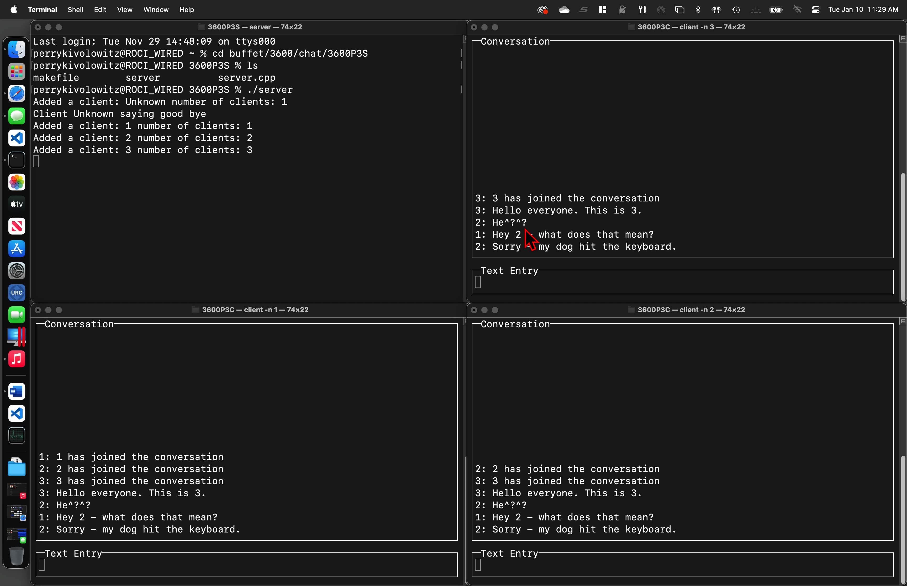
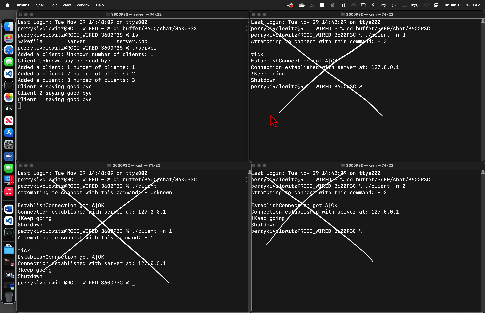

# Retro Chat

This specification describes two projects whereby the client side and
server side are split apart for implementation as separate projects. The
end-goal is a multiuser online chat system featuring a multi-threaded
server and a cool retro looking client.

## READ THIS SPEC VERY CLOSELY

You are advised in the strongest terms to completely digest this
specification because:

* Your client has to talk to my server and your server has to talk to
my client.

* Secondly, there is a lot of **teaching** embedded in this
specification. Overlook it at your **peril**.

## Assumed Knowledge

Before attempting these projects, the instructor must cover:

* signals - the bare minimum.

* c++ threads.

* `mutex`.

* `map`.

* `curses`.

## Signals

Curses applications  (i.e. your client) that change terminal properties
such as echo and delay must be exited cleanly, putting those changed
setting back to their original values.

In this project, the clients are terminated with ^c (Control C where
the C is actually c). This suddenly and without warning kills the
running process and in so doing, will leave your terminal in a sad and
sorry state.

A terminal's settings can be made sane again from the command line
using:

```stty sane```

However, forcing the user to take this step when the programmer of the
application can fix things on their own, isn't cool. To fix things
before the application exits, the ^c must be intercepted explicitly.

^c is an example of a Unix *signal*. You can register a signal handler
using:

```signal(SIGINT, SIGINTHandler);```

This can be called early in `main()`.

Where `SIGINT` is the name of the signal that ^c sends and
`SIGINTHandler` is the name of your function that will be called
**asynchronously** when a `SIGINT` is received.

This **asynchronous** nature is a bit difficult to wrap one's head
around because it means that many system calls that you previously
thought won't return until complete, can in fact return early.

Take, for instance, `recv()` without the `MSG_DONTWAIT` flag. Assuming
a TCP connection, if you expect N bytes... you'll wait for N bytes to
be available (or a socket close). Should you receive a `SIGINT`, for
example, the `recv()` will return early either because your program
will terminate or you've handled the signal.

You can tell when a system call is interrupted by looking at your
friend `errno`. If it has a value of `EINTR`, the system call was
interrupted by a signal.

*(Other `errno` values you need to be aware of in this project are
`EAGAIN` and maybe `EWOULDBLOCK`.)*

I suggest your `SIGINT` handler set a globally defined boolean flag
to false. That flag should be frequently checked. When found to be
false, gracefully exit taking care to first close down `curses` in
an orderly fashion.

## C++ Threads

Prior to C++ version 11, threading was not a standard part of C++.
Instead, the C `pthreads` API was used. Since C++ version 11, threads
have been a standard part of the C++ ecosystem. Your server must be
multithreaded. Each connection you get (`accept()`) must be handled
from its own thread.

In this case, your spawned threads do not strictly have to be
`join()`ed. This is because your server will be exiting immediately.
This isn't exactly being a considerate camper but it's OK for the
purposes of this project.

## `mutex`

Your server is multithreaded - that means you have the potential for
collisions over any shared resources. Suppose two threads handling
two different clients receive data at the same time. Both threads will
want to broadcast the data to all other clients but at the same time.
Clearly, they cannot as to do so will result in muddled data being
broadcast.

The sending of data to a client is a shared resource. It must be
protected.

Further, the list of clients is a shared resource that must be
protected. For example, suppose another client is accepted at the
same moment you're enumerating the list of clients in order to
broadcast to them. You cannot change the list while enumerating the
list.

`mutex` standards for mutual exclusion - it is a means to allow only
one thread into a section of code at any one time. You will have to
use `mutex`es to protect any resource that is shared amongst more than
one thread.

## `map`

Within my server, I used a `map` to keep track of clients. Maybe you
should too. This is a suggestion, not a requirement.

## `curses`

You will have to use `curses` in your code. By `curses`, I mean the
terminal handling API, of course.

The following is a list of the `curses` functions I used in my
client. This list may not be exhaustive and is a hint only.

* `initscr`

* `wmove`

* `wclrtoeol`

* `cbreak`

* `nodelay`

* `scrollok`

* `box`

* `wrefresh`

* `mvwprintw`

* `wgetch`

* `wsetscrreg`

* `scroll`

* `endwin`

See more information relating to `curses` in the client's
specifications.

## The Protocol

The protocol consists of three commands, H, G and T in the form of:

```[H or G or T]|Data```

There is also one acknowledgement sent from the server to a newly joined
client:

```A|OK```

**All of these end in `\n`.**

Examples:

A Hello message is sent from the client to the server to inform the
server the client has entered the conversation and with what user name.

```H|George```

In response to a hello message, the server sends back:

```A|OK```

The server might decide not to respond to a new client if, for example,
the client seems to be already connected. Therefore, the client must be
designed to time out in some way if it does not receive the
acknowledgement message from the server. There are a number of ways to
do this. You must choose one and implement it. The client must not be
hang waiting for `A|OK`.

A Goodbye message is sent from the client to the server before
terminating to inform the server that the client is leaving. This is
part of the orderly shutdown that includes shutting down `curses`.

```G|OODBYE```

Notice this does not include the user's name - in receiving this message
you will get information about the sender. You will have seen this
information before and are expected to have memorized it, associating
with a specific client.

A Text message is sent fin either direction. The data is everything
after the vertical bar.

```T|This is a message```

It is absolutely required that **all** messages end in \n.

## Decoupling Low Level and High Level Reception

The server (or client) might send:

```T|Here is a first line of text.```

and then send

```T|This is a second line of text.```

The other side might receive in each attempt to read from the socket:

```T|Here is```

then

```a first line```

then

```of text.\nT|This```

The reason for this is that you must `recv` with the `MSG_DONTWAIT`
flag in order not to block waiting for an unknown number of bytes. You
will get whatever happens to be available at the moment you ask for
bytes.

If we call the reading of partial and even mixed lines of text the low
level, then the high level is where complete and separated lines of text
are assembled for processing.

*This division into lower level and higher level code is very common and
is in fact the basis of much of a networking stack. One layer makes use
of the features of a layer below it, exposing features to the layer
above it.*

## Client Appearance

Here is a screenshot of three clients connected to one server. The
client's names are 1, 2 and 3.

<figure>
  
  <figcaption>Server with three clients.</figcaption>
</figure>

Your client must look like these. There are two "windows" which must
scroll correctly.

The `Text Entry` area must not scroll at all. You must prevent a long
line from going beyond the right hand border by detecting the line's
length and sending it before it reaches the right hand side.

## Server Appearance

You're free to put a small amount of debugging information in the
server.

<figure>
  
  <figcaption>Pay attention to the server window.</figcaption>
</figure>

## Client Command Line Options

You must implement the following:

* `-h` prints help text and exits.

* `-s server_ip` overrides the default server IP address of 127.0.0.1.

* `-p port` overrides the default port number of 5077.

* `-n name` overrides the default client name of Unknown.

## Server Command Line Options

You must implement the following:

* `-h` prints help text and exits.

* `-p port` overrides the default port number of 5077.

## Work Rules

Feel free to talk to each other about anything `curses` related.
Explicit sharing of code should be avoided.

Do not talk to each other about anything networking related.

## Demonstration Day

Everyone in class will be expected to connect to my server - we will all
have a conversation.
